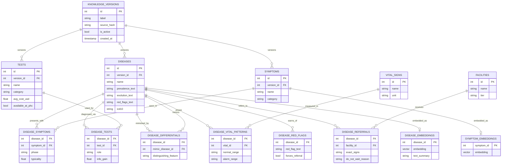
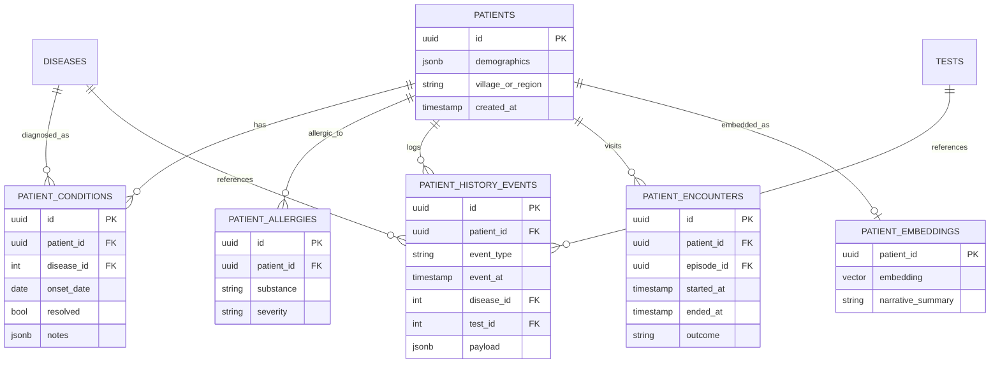
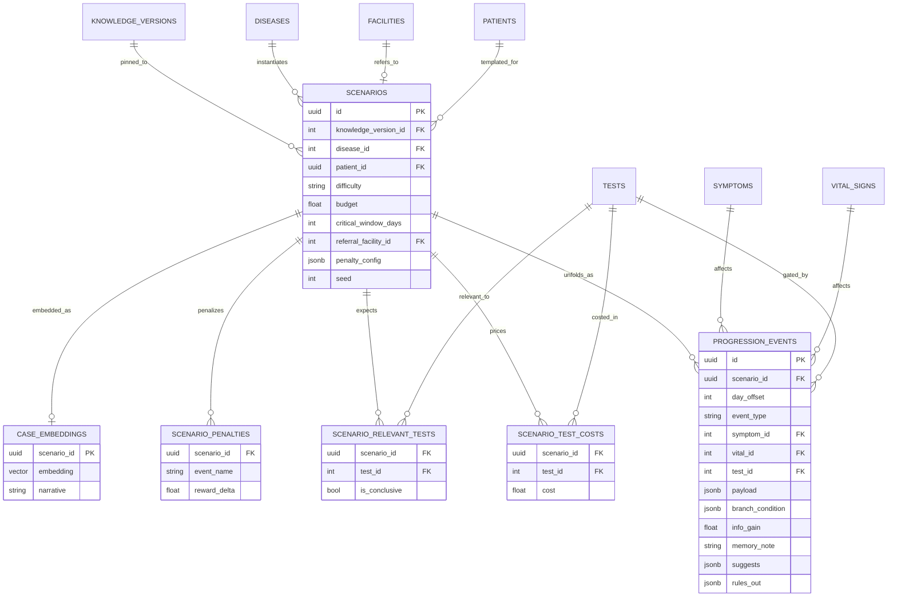
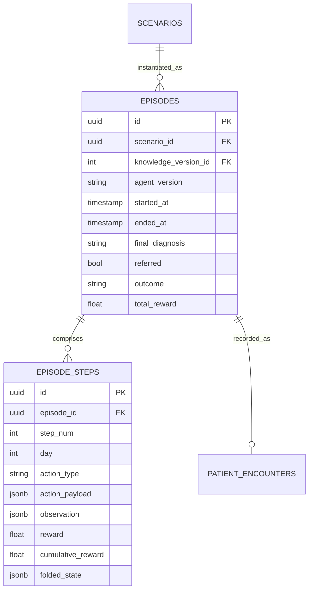
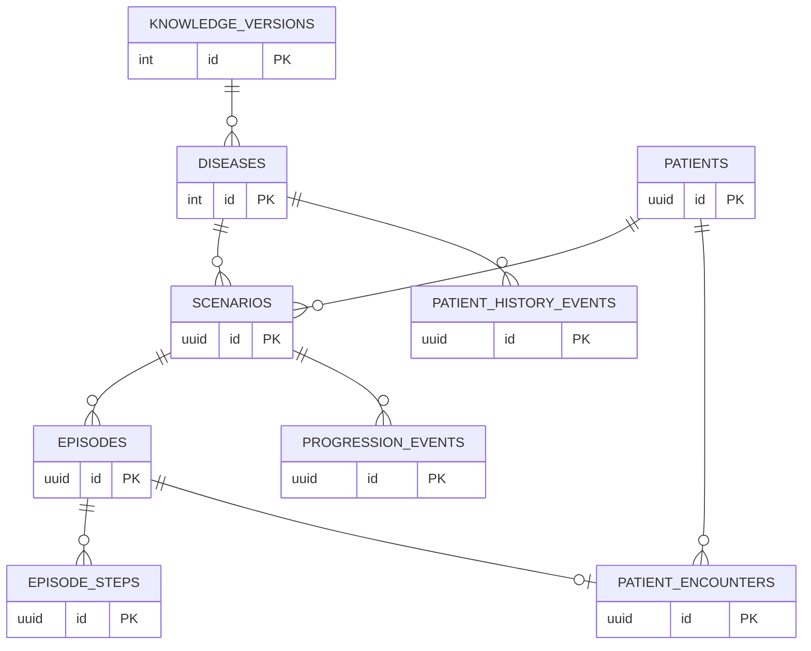

# RuralDoc — Supabase Schema (ER, v1)

- **Hybrid retrieval**: relational FK graph for structured reasoning + `pgvector` embeddings for fuzzy symptom / case similarity.
- **Versioned knowledge layer**: the clinical graph is regenerated on CSV / guideline updates; every scenario and episode pins to a `knowledge_version_id` so training runs remain reproducible.
- **Patient is first-class**: persistent identity across encounters, with a longitudinal history that the agent can condition on and that downstream learning can replay.
- **Event-sourced progression**: patient state per day is folded from ordered events (symptom onset/resolution, vital deltas, lab transitions), with branch conditions so treated vs. untreated trajectories diverge naturally.

The model splits into four layers: **Knowledge**, **Patient & History**, **Scenario + Progression**, **Episode (runtime)**. Each gets its own diagram; a final diagram shows the cross-layer FK edges.

---

## 1. Clinical Knowledge Layer

Sourced from `PHC Disease Guidelines.csv`. Versioned — regenerating rebuilds junction tables under a new `knowledge_version_id` and atomically flips the `is_active` pointer.

**Regeneration flow** — a nightly (or on-commit) job parses the CSV, diffs against the active version, writes a new `knowledge_versions` row with `is_active=false`, populates all child tables under it, validates (every scenario's `conclusive_test` resolves, every differential points both ways), then atomically flips `is_active`. Scenarios and episodes keep pointing at whichever version they were authored / run under.

---

## 2. Patient & Longitudinal History Layer

Per-patient data the agent should see on each new encounter. This is what makes the RL problem non-Markov in a useful way — a known-diabetic patient's "fatigue + polyuria" should read very differently than a stranger's.

**`patient_history_events`** is the key table — a generic typed event log (`prior_diagnosis`, `test_performed`, `medication_started`, `chronic_flare`, `pregnancy`, etc.) that the agent can query at encounter start. `PATIENT_EMBEDDINGS` lets you retrieve "similar patients" for few-shot context before the first action.

---

## 3. Scenario + Event-Sourced Progression Layer

Scenarios are templates; progression is a stream of events, not day snapshots. To get patient state at day *N* with treatment vector *T*, fold all events where `day_offset ≤ N` and `branch_condition ⊆ T`.

**`event_type` examples**: `symptom_onset`, `symptom_resolved`, `vital_shift`, `test_becomes_positive`, `status_transition`, `penalty_event`. **`branch_condition`** is a JSONB predicate like `{"treated_with": "artemisinin", "before_day": 4}` — the fold skips events whose conditions aren't met by the current episode state. This cleanly supports "untreated malaria spikes fevers" vs. "treated malaria resolves by day 3" without duplicating rows.

---

## 4. Episode (Runtime) Layer

What the RL loop actually writes. Keep this thin and append-only — it's your offline-RL goldmine.

`folded_state` caches the event-fold output at each step — useful for debugging and for offline RL without re-folding. `knowledge_version_id` on `EPISODES` lets you compare policies fairly across guideline updates.

---

## 5. Cross-Layer FK Overview

The edges that actually matter for agent traversal:

Two paths matter most for the agent's hot query:

1. `EPISODE_STEPS → EPISODE → SCENARIO → DISEASE → DISEASE_SYMPTOMS / DISEASE_TESTS` — structured reasoning over the current case.
2. `EPISODE_STEPS → EPISODE → SCENARIO → PATIENT → PATIENT_HISTORY_EVENTS` — personalization / prior-visit context.

Vector lookups happen in parallel: `SYMPTOM_EMBEDDINGS` for fuzzy symptom matching, `CASE_EMBEDDINGS` for few-shot retrieval of similar scenarios, `PATIENT_EMBEDDINGS` for similar-patient retrieval.

---

## Open design questions before writing SQL

1. **Patient reuse across scenarios** — should the same `patient_id` appear in multiple scenarios (recurring patients, longitudinal learning) or is every scenario a fresh synthetic patient? Affects uniqueness constraints on `SCENARIOS.patient_id`.
2. **Progression branch vocabulary** — what's the closed set of keys allowed in `branch_condition` JSONB (`treated_with`, `referred_by_day`, `budget_below`, etc.)? I'd rather define this upfront than let it sprawl.
3. **Embedding generation** — generated offline in a worker, or at write time via a Supabase edge function? And which model?
4. **Knowledge-version retention** — keep forever for reproducibility, or rolling window of last N versions?

If those answers are straightforward, next step is the CREATE TABLE migration + seed script from the CSV.
